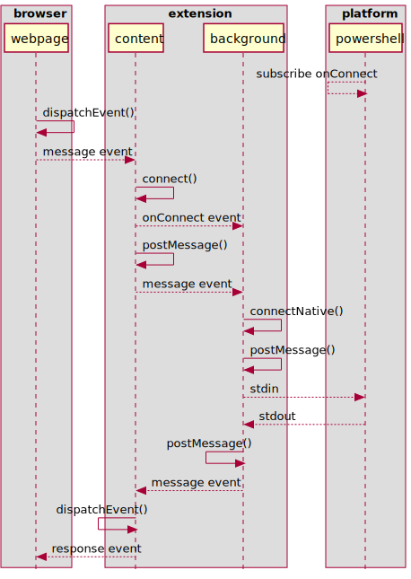

 # PowerShell Interactor Browser Extension
 
This is a minimal example of a browser extension that allows a Web application
or site to interact with PowerShell running locally on the host system.

I need some help resolving the issue described below. I tried to make it as 
easy as possible to run this example; I've even provided a simple web server
that runs the web app with no configuration necessary.

This design may be useful for extensions that show a nice feature rich popup
page, and it's the main UI the user interacts with. However, this isn't a
good setup to support arbitrary web pages communicating with the extension.
I need some help on what direction to take to support the latter scenario.

The sequence diagram below shows which particular browser API's were used to
communicate between the components.

### Sequence Diagram

```console
+---------+       +---------+       +---------+   |   +------------+
| webpage | <---> |"middle" | <---> |  worker | <-|-> | powershell |
+---------+       +---------+       +---------+   |   +------------+
  Web App         : . . . . Extension . . . . :   |   Host Platform
     :                  :                :                  :
runtime.sendMessage()-> :                :                  :
     :                  :                :                  :
     :     navigator.serviceWorker       :                  :
     :              .controller          :                  :
     :              .postMessage() ----> :                  :
     :                  :                :                  :
     :                  :     runtime.connectNative()       :
     :                  :            .postMessage() ------> :
     :                  :                :         stdin -> :
     :                  :                :<-------------- stdout
     :                  :<--------- MessageChannel          :
     :                  :            .postMessage()         :
     :<------------ callback()           :                  :

```
### Components
|Component|File|Description|
|---------|----|-----------|
|webpage  |`website\app-script.js`|The script in the page the user interacts with.|
|"middle" |`extension\extension.js`|The go-between for the webpage and background service worker.|
|worker   |`extension\background.js`|The background service worker that interacts with PowerShell.|
|powershell|`pshost\host.ps1`|A PowerShell process started by the browser and connected via Native Messaging.|

### Sequence
* The webpage sends a message along with a response callback to the middle 
  component using `chrome.runtime.sendMessage()`.
* The middle component's `runtime.onMessageExternal` listener receives the 
  message. It then creates a `MessageChannel` to pass to the worker so it can
  receive the response later. One port of this channel is passed along with the
  message to the worker.
* The worker receives the message and port via its `window.onmessage` listener.
  It then sends the message to the native host, and recieves the host's 
  response. 
* The response is passed from the worker back to the middle component through
  the `MessageChannel` port shared by the two.
* The middle component then passes the response to the webpage via the callback
  the webpage provided with the initial request.

## Supported Scenario
  
 This solution works under a specific scenario: the extension popup is 
 displayed.
 
 A webpage can communicate with the service worker via the popup. The popup 
 page has a `<script>` reference to a JavaScript file implementing the message
 passing between webpage and service worker.
 
  ## Problem
 
I want my web app to be able to indirectly send and receive data to/from the 
PowerShell process via these other components at any time. This should work
when there are no extension windows (popup/context) showing.

As it is now, I have to use the DevTools Inspector on the extension's popup
to force it to stay active while I test the web app.

## Solutions?

I'm looking for any approach that lets my web app (web page) access the 
background service worker on demand to communicate with PowerShell.

One approach I tried involved finding a way to keep one page within the 
extension loaded, but not visible. I thought that maybe the `sandbox` field in
`manifest.json` could accomplish this, but I didn't have any luck. I tried 
importing the webpage facing script of the extension into the background 
service worker, but wasn't sure how to proceed since I'd have to redo the 
messaging passing between the middle script and web page. Plus the service
worker may not stay loaded - so same problem I have with the "middle" component
put inside the popup.

The next direction I'll likely take is a content page approach with injecting
Javascript into the browser's active window. Maybe the API's used could be 
be the same, or similar, to what's in between "middle" and worker in the
sequence diagram now. I think that's unlikely though...

## Setup

The steps to get this to run on a Windows system are relatively easy:

* On Windows, add registry entry for the host process:
  * `HKCU:\Software\Google\Chrome\NativeMessagingHosts\com.tweedle.examplehost`
  * Set its `REG_SZ` value to the absolute path of the host's manifest file.
    For example, 
    `C:\Users\todd_\projects\example-extension\pshost\manifest.json` 
* Load the unpacked extension in Chrome or MS Edge and make a note of its ID 
  once loaded. The ID will look something like, 
  `ibmjbffabdgooobjlmgbpabpknndpgdn`.
* In the file, `\pshost\manifest.json`, update the `"allowed_origins"` field
  with the extension's ID.
  * Also update the `"path"` field with the absolute path to the batch file,
    `\pshost\runhost.bat`.
* In `\website\app-script.js`, `line: 4`, update the extension ID.
* Open a command shell console and `cd` in to the `\website` folder and run
  the `webserver.py` script. Then open your browser to `http://localhost:4040`

After the set up is done, open the browser to the local site. The page has one
button on it that sends a request and recevies a response.

* Right-mouse-click the loaded extension icon and select `Inspect popup` to open
  the DevTools Inspector. This will force the extension's popup page to stay 
  loaded.
* Set breakpoints in the listeners or other interesting points in code.
* Press the button and observe the effects.
* The PS host produces a log in its own folder, `log.txt` that can be checked to
  make sure it's receiving and sending.
## New Approach

After some reading and experimentation, I've found a workable solution to 
support communication between the components.

