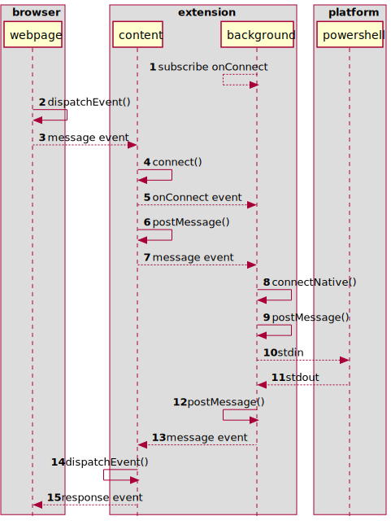

 # PowerShell Interactor Browser Extension
 
This is a minimal example of a browser extension that allows a Web application
or site to interact with PowerShell running locally on the host system. The 
average file length is around 10 lines of code. Very minimal.

## Use With Caution

For security reasons, sending arbitrary PowerShell commands isn't implemented. 
The extension supports a single command that returns a listing of files in the 
native host's working directory.

Any commands added to the example should be designed not to permit the 
extension's use as a potential attack vector. For instance, if the PowerShell
based native host processed raw text from the browser using `Invoke-Expression`, 
the extension could theoretically be exploited.

The browser has security measures that are intended to protect extensions from
pages and other extensions gaining unsafe access. The manifest file for this
extension should be free of any rules that would allow such access. However,
it's prudent not to take this security for granted. Only implement features 
you need, and restrict their access as much as possible to mitigate any
"what if" scenarios should they ever occur. 

In the extension's manifest, the `"content_scripts"."matches"` field controls
what pages the *content script* is loaded to. As it is now, the script will
load to any `localhost` page. Make sure this filter is set to only allow 
URL's you have control over. Any page the *content script* is loaded to has
access to the extension's features.

## Communication From Webpage to Native Process

It took me some reading of documentation, hunting the 'net for answers, and 
experimentation to find a workable solution that supports communication between 
all components of the extension. These components include the extension *content
scripts*, extension *service worker*, webpage scripts, and the Native Messaging
host.

The approach uses two `CustomEvent`s to support communication between the 
script running in the webpage and the extension's *content script*. The events
are dispatched through the `window` object from both endpoints. Each endpoint 
registers for its respective event with code similar to:

```javascript
window.addEventListener('incomingMessage', (e) => { e.detail ...});
window.addEventListener('outgoingMessage', (e) => { e.detail ...});
```

For communication between the extension's *content script* and its *service 
worker* (background script), the `browser.runtime.onConnect` event is subscribed
to by the *service worker*. The *content script* can then use 
`browser.runtime.connect()` to initiate a connection with the *service worker*.
Each endpoint receives a port object that they can use to pass messages to each 
other via the port's `postMessage()` method. Each receives messages through 
the port's `onMessage` event.

### Sequence Diagram



### Diagrammed Components
|Component|File|Description|
|---------|----|-----------|
|webpage  |`website\app-script.js`|The scripts in the page the user interacts with.|
|content  |`extension\extension.js`|The *content script* of the extension.|
|background|`extension\background.js`|The background *service worker* that interacts with PowerShell.|
|powershell|`pshost\host.ps1`|A PowerShell process connected via Native Messaging.|

A *content script* is a script that gets injected into any web page the 
extension manifest permits. It has access to the target page's DOM, but not 
its JS code or objects. The page also can't access the code of the *content
script*. The *service worker* is similar to a web worker, but has access to
the Native Messaging interface and other privileged features. *Native Messaging*
is the feature that allows the browser to interact with host processes over 
standard I/O.

### Sequence Details

* **(1)** Each component, when loaded, sets up its event handlers. One 
  particularly important subscription is the *service worker*'s (background's) 
  registration for `browser.runtime.onConnect`. This is the magic that enables 
  waking up the dormant worker for messaging.
* The webpage scripts and *content script* register for custom events they
  each generate. These events are posted to the `window` object. This allows
  messages to be passed between them as event data.
* **(2-5)** When a browser script fires a message event to the *content script*,
  a *content script* then wakes up the *service worker* by calling 
  `browser.runtime.connect()`.
* **(5)** The *service worker's* registered listener saves the shared *port* it 
  received from the event for passing back the response later. It also attaches
  a listener to the port for receiving messages.
* **(6-7)** The *content script* then invokes `port.postMessage()` on its shared 
  port, which fires a message event to the *service worker*.
* **(8)** The *service worker* then initiates a connection to the Native 
  Messaging host process via, `browser.runtime.connectNative()`. The worker 
  receives back a shared port to receive the response from the host.
* **(9-11)** The browser wakes up the host process and transacts with it over 
  standard I/O. When it has received a complete response from the host, a 
  message is posted back to the *service worker*.
* **(11-13)** The *service worker* receives the message via the port it shares 
  with the host, and posts a message back to the *content script* via their 
  shared port.
* **(13-15)** The *content script* receives the message event and fires a custom
  event to the `window` object.
* The webpage script receives the custom event that holds the response from the
  native host and displays it.

## Example Requirements

This example can run on Linux, but the instructions below have some steps
specific to Windows. Anyone savvy, or bold, enough to experiment with this 
project shouldn't have too much difficulty translating the steps for Linux or
Mac.
* PowerShell Core is needed. Also known as PowerShell 7. PowerShell has versions
  for Mac and Linux as well as Windows.
* Python 3 to run the simple HTTP server. Otherwise, you can host the webpage
  in any other web server.
* Example was tested in Chrome and MS Edge. It's likely supported on any 
  browser based on the same internals.

## Setup

The steps to get this to run on a Windows system are relatively easy:

* On Windows, add registry entry for the host process:
  * `HKCU:\Software\Google\Chrome\NativeMessagingHosts\com.tweedle.examplehost`
  * Set its `REG_SZ` value to the absolute path of the host's manifest file.
    For example, 
    `C:\Users\todd_\projects\example-extension\pshost\manifest.json` 
* Load the unpacked extension in Chrome or MS Edge and make a note of its ID 
  once loaded. The ID will look something like, 
  `ibmjbffabdgooobjlmgbpabpknndpgdn`.
* In the file, `\pshost\manifest.json`, update the `"allowed_origins"` field
  with the extension's ID.
  * Also update the `"path"` field with the absolute path to the batch file,
    `\pshost\runhost.bat`.
* Open a command shell console and `cd` in to the `\website` folder and run
  the `webserver.py` script. Then open your browser to `http://localhost:4040`

After the set up is done, open the browser to the local site. The page has one
button on it that sends a request and recevies a response.

* Right-mouse-click the loaded extension icon and select `Inspect popup` to open
  the Dev Tools Inspector for extension debug. Press `[ctrl]-[shift]-i` to open
  Dev Tools for the webpage.
* Set breakpoints in the listeners or other interesting points in code.
* Press the button and observe the effects.
* The PS host produces a log in its own folder, `log.txt` that can be checked to
  make sure it's receiving and sending.

The `\pshost\runhost.bat` file has an absolute path to the PowerShell 7/Core
executable on Windows. This will need to be modified to the absolute path
on the host system if using Linux or Mac. I don't know if the PowerShell 
console on other platforms supports `.bat` files, so it may need conversion 
to a `bash` script - it's only a couple lines of code. Simple.

The registration of the Native Messaging host on Mac and Linux will also be
different. Check [this reference](https://developer.chrome.com/docs/apps/nativeMessaging/#native-messaging-host-location) for details.
